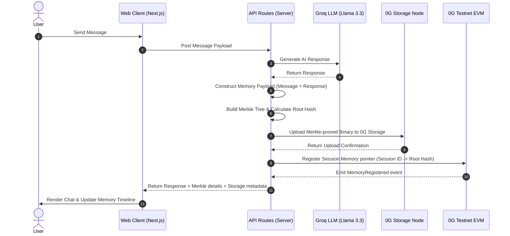

# ChainMemory 🧠⛓️

**ChainMemory** is a premium decentralized AI chat agent that features persistent, secure, and verifiable memory anchored directly onto the **0G Storage Network**. Every conversation turn is serialized, compiled into a Merkle tree, content-addressed, and permanently stored on-chain. This guarantees that your AI agent's memories are completely sovereign, owned by you, and cryptographically verifiable by anyone.

Built for the **0G Zero Cup 🏆**

[Live Demo 🚀](https://chain-memory.vercel.app) | [Github Repository 📁](https://github.com/ritesh59697/ChainMemory)

---

## 🌟 Key Features

*   **Sovereign & Decentralized Memory**: Shakes off reliance on centralized database servers. Chat logs are stored as permanent, immutable data blocks on decentralized 0G storage nodes.
*   **Cryptographic Merkle Proofs**: Automatically transforms every user and assistant message pair into a serialized payload, constructing a Merkle Tree where the root hash represents a verifiable digest of that specific memory turn.
*   **On-Chain Registry**: Pairs memory uploads with a Solidity registry contract (`MemoryRegistry.sol`) deployed on the **0G Testnet EVM** to index session logs.
*   **Hybrid Storage Engine**: Integrates a seamless fallback mode that indexes metadata locally at `/data/memory-index.json` while maintaining zero-trust 0G Storage Node uploads if the smart contract registry is omitted.
*   **Premium Interactive Interface**: A sleek, premium dark/light mode dashboard featuring status badges for 0G nodes, an interactive step-by-step memory builder map, and an inspection modal for raw JSON metadata fetched from 0G.

---

## ⚙️ How It Works (Architecture)



### 1. Serialized Memory Payload
Every conversation exchange translates to a defined metadata payload containing `sessionId`, `role`, `content`, and a high-precision `timestamp`.

### 2. Merkle Tree Packaging
Using the official `@0gfoundation/0g-storage-ts-sdk`, the serialized payload is formatted into a byte array, chunked, and wrapped in a `MemData` structure to calculate the corresponding Merkle Root Hash.

### 3. Decentralized Anchoring
The server-side API signs the upload using a funded wallet key (`ZG_PRIVATE_KEY`) and publishes it to the decentralized storage network.

### 4. Smart Contract Registry mapping
The transaction pointer, root hash, and session mapping are registered on the `MemoryRegistry` Solidity smart contract. This forms a verifiable chain of custody for the agent's historical context.

---

## 🛠️ Tech Stack

*   **Core Framework**: [Next.js 14 (App Router)](https://nextjs.org/) + TypeScript
*   **Styling & UI**: Tailwind CSS (Optimized for modern contrast and fluidity)
*   **Inference Engine**: [Groq SDK](https://console.groq.com/) using `llama-3.3-70b-versatile`
*   **Decentralized Storage**: `@0gfoundation/0g-storage-ts-sdk`
*   **Web3 Engine**: `ethers` v6 (for standard EVM provider interactions and registry transactions)
*   **Development / Deploy Environment**: Hardhat (Solidity compilation and local tests)

---

## 📁 Repository Overview

```
├── app/
│   ├── api/
│   │   ├── chat/              # Groq completion engine
│   │   ├── memory/
│   │   │   ├── fetch/         # Reads raw logs from 0G Storage Indexer
│   │   │   ├── index/         # Local metadata registry fallback
│   │   │   └── save/          # Packages payload & uploads to 0G Storage Nodes
│   │   └── page.tsx           # Premium Chat UI + Inspection details modal
├── contracts/
│   └── MemoryRegistry.sol     # Registers memory root hashes mapping to session IDs
├── scripts/
│   └── deploy.js              # Standard ethers deployment script for MemoryRegistry
└── public/                    # Static UI logo assets and screenshots
```

---

## 🚀 Setup & Local Installation

### Prerequisites
*   Node.js 18+ and npm
*   A Groq API key (available at [Groq Console](https://console.groq.com/))
*   An EVM-compatible private key funded with 0G Testnet tokens. Claim them at the [0G Faucet](https://faucet.0g.ai/).

### Step 1: Install Dependencies
Clone the repository and install packages:
```bash
npm install
```

### Step 2: Set Up Environment Variables
Create a `.env.local` file from the template:
```bash
cp .env.example .env.local
```
Update the properties inside `.env.local`:
```env
GROQ_API_KEY=your_groq_api_key_here
ZG_PRIVATE_KEY=your_funded_wallet_private_key_here
ZG_EVM_RPC=https://evmrpc-testnet.0g.ai
ZG_INDEXER_RPC=https://indexer-storage-testnet-turbo.0g.ai

# (Optional) On-Chain Memory Indexing Address
# Leave blank to operate in local metadata mode while uploading logs to 0G Storage
ZG_REGISTRY_CONTRACT_ADDRESS=your_deployed_contract_address_here
```

### Step 3: Run the Development Server
```bash
npm run dev
```
Navigate to [http://localhost:3000](http://localhost:3000) to interact with ChainMemory.

---

## 📜 Smart Contract Deployment (0G Testnet EVM)

To run a fully decentralized registry on the 0G network, compile and deploy the Solidity contract:

1. **Compile the Solidity Contract**:
   ```bash
   npx hardhat compile
   ```
2. **Deploy standard contract**:
   ```bash
   node scripts/deploy.js
   ```
3. Copy the contract address output from the script, paste it in your `.env.local` as `ZG_REGISTRY_CONTRACT_ADDRESS`, and restart the Next.js server.
