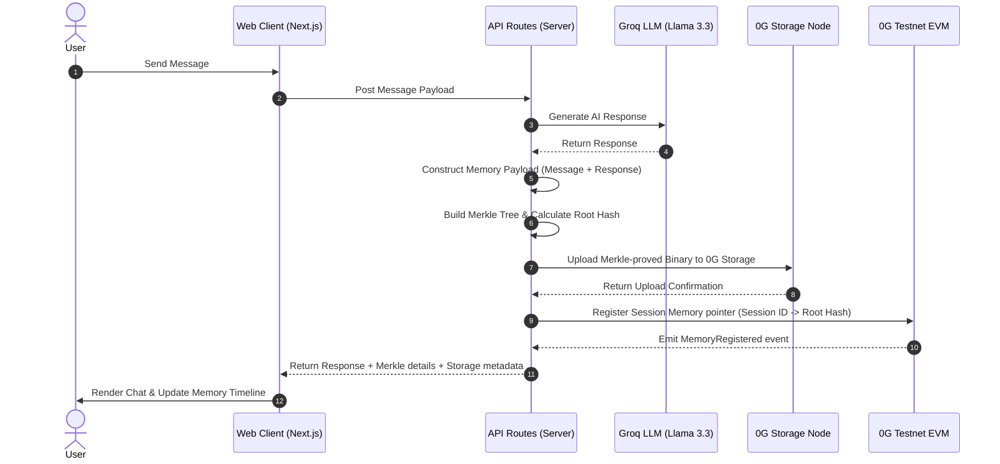

# ChainMemory 🧠⛓️

> **Decentralized, sovereign memory for AI agents – every conversation turn Merkle-proved and anchored on 0G Storage.**

Built for the **[0G Zero Cup 2026](https://0g.ai/arena/zero-cup)**.

**[Live Demo](https://chain-memory.vercel.app)** · **[Video](https://youtu.be/YOUR_VIDEO_URL_HERE)**

---

## The Problem

Every AI chat application today stores your conversation history in centralized servers. If the service provider shuts down, your memory logs are lost forever. More importantly, there is no cryptographic guarantee of what the AI was told or how it responded—leading to data ownership loss and zero verifiability.

## The Solution

ChainMemory shifts this paradigm by utilizing **0G Storage** to construct a persistent, sovereign, and verifiable memory layer for autonomous AI agents. By compiling conversation logs into Merkle trees and anchoring them directly onto decentralized nodes, your agent's memory becomes secure, permanent, and cryptographically provable.

---

## Technical Architecture & How 0G Storage is Used



1. **Content-Addressed Payload**: Each conversation turn `{ sessionId, role, content, timestamp }` is serialized into a raw byte array.
2. **Merkle Proof Packaging**: The payload is wrapped into a custom `MemData` structure using `@0gfoundation/0g-storage-ts-sdk`. The SDK constructs a Merkle Tree where the root hash serves as a cryptographic digest of the memory block.
3. **Decentralized Anchoring**: The server-side API signs the storage submission using the wallet private key (`ZG_PRIVATE_KEY`) and publishes the data directly to 0G storage nodes through the EVM RPC node and storage indexer.
4. **Verifiable Retrieval & Indexing**: Pointers mapping `sessionId` to the Merkle `rootHash` are registered in the `MemoryRegistry.sol` Solidity contract deployed on the 0G Testnet EVM (or locally cached when operating in fallback mode).

---

## Tech Stack

*   **Framework**: Next.js 14 (App Router) + TypeScript
*   **Styling**: Tailwind CSS (Clean, premium dark/light mode contrast)
*   **AI Core**: Groq SDK using the `llama-3.3-70b-versatile` model
*   **Decentralized Storage**: `@0gfoundation/0g-storage-ts-sdk`
*   **Web3 Engine**: Ethers.js v6 for signing storage transactions and contract interactions
*   **Smart Contract Tooling**: Hardhat for compilation and deployment

---

## Project Structure

```
├── app/
│   ├── api/
│   │   ├── chat/              # Groq integration
│   │   ├── memory/
│   │   │   ├── fetch/         # Retrieves logs from 0G Storage Indexer
│   │   │   ├── index/         # Local metadata index fallback
│   │   │   └── save/          # Packages payload & uploads to 0G Storage Nodes
│   │   └── page.tsx           # Dashboard UI with sidebar timeline and verification modal
├── contracts/
│   └── MemoryRegistry.sol     # Mapping session IDs to 0G Merkle root hashes
├── scripts/
│   └── deploy.js              # Standard contract deployment script
└── public/                    # Clean assets and cover imagery
```

---

## Setup & Local Installation

### Prerequisites
*   Node.js 18+ and npm
*   A Groq API key
*   An EVM private key funded with 0G Testnet tokens (claimable on the [0G Faucet](https://faucet.0g.ai/))

### Step 1: Install Dependencies
```bash
npm install
```

### Step 2: Configure Environment Variables
Copy the template `.env.example` to `.env.local`:
```bash
cp .env.example .env.local
```
Configure your environment variables:
```env
GROQ_API_KEY=your_groq_api_key_here
ZG_PRIVATE_KEY=your_funded_wallet_private_key_here
ZG_EVM_RPC=https://evmrpc-testnet.0g.ai
ZG_INDEXER_RPC=https://indexer-storage-testnet-turbo.0g.ai

# (Optional) Contract address for on-chain indexing
# Omit this to run in Local Fallback Mode
ZG_REGISTRY_CONTRACT_ADDRESS=your_deployed_contract_address_here
```

### Step 3: Run the App
```bash
npm run dev
```

---

## Smart Contract Registry Deployment

To deploy your own instance of the `MemoryRegistry` contract:

1. **Compile**:
   ```bash
   npx hardhat compile
   ```
2. **Deploy**:
   ```bash
   node scripts/deploy.js
   ```
3. Update `ZG_REGISTRY_CONTRACT_ADDRESS` in `.env.local` with the deployed address.
